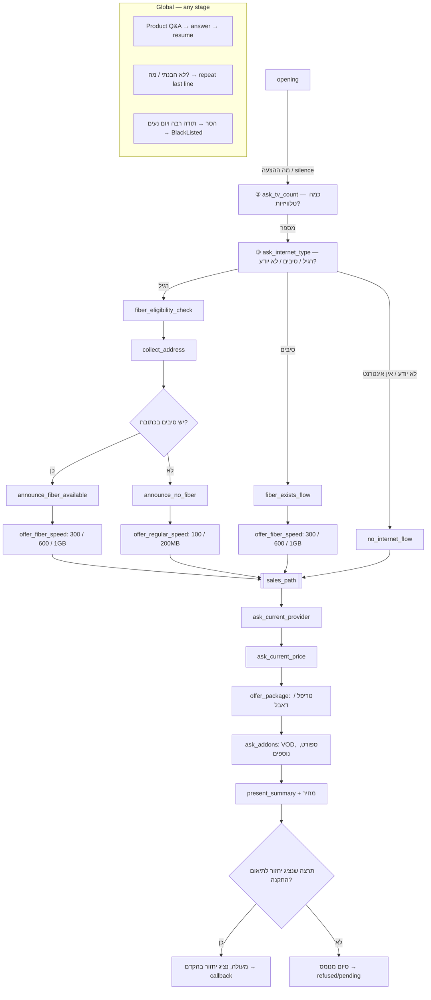

## Context

AICaller today runs outbound calls primarily through a **visual graph** (`GraphFlowEngine`) with intent-based branches (Sigal flow). The product owner wants a **scripted, stage-by-stage** outbound call: fixed Hebrew copy per stage, legal opt-out (“הסר”), and a compliance-oriented opening. At the same time, customers must be able to ask product questions **at any time** without derailing the script—the runtime answers and **returns to the same stage**.

Stage content is defined **incrementally** with the product owner. This design now documents the **full outbound flow** from opening through human callback handoff, aligned with the MiniFlow diagram.

Constraints: Hebrew RTL, ElevenLabs TTS, Twilio telephony, existing catalog/knowledge tools, SQLite/Prisma.

## Full flow map



## Goals / Non-Goals

**Goals:**
- Staged flow runtime with persisted `currentStageId` per call
- Stage 1 opening (exact script below) with listen → classify → branch
- Global Q&A interrupt: product intents answered via catalog/LLM, then **resume same stage** (re-prompt or continue listen as defined per stage)
- `הסר` → goodbye, hangup, contact `blacklisted`, never auto-dial again
- `מה ההצעה` / offer intent / **silence** after opening → advance to TV-count qualification
- Global **repeat last statement** on "לא הבנתי" / "מה?"
- Internet-type branch → one of three sub-flows (fiber check, no internet, fiber exists)
- Seed/migrate default active flow to staged model

**Non-Goals (this change):**
- Real fiber-address API integration (stub/mock acceptable v1; operator manual review fallback)
- Removing the graph flow builder (kept for power users; not default outbound path)
- SMS/email opt-out registry beyond in-app blacklist
- Replacing ElevenLabs or Twilio

## Decisions

### 1. Staged flow engine alongside graph engine

**Decision:** Introduce `StagedFlowEngine` (or `stagedFlow` module) selected when active `CallFlow` has `flowType: "staged"` or published staged JSON. `callService` dispatches: staged → staged engine; graph → existing `GraphFlowEngine`; legacy → linear.

**Rationale:** Clean separation; graph remains for customized flows.

**Alternatives:** Encode stages as a degenerate graph (rejected—harder to script and resume).

### 2. Stage definition format

**Decision:** JSON stages array on `CallFlow`, e.g.:

```json
{
  "flowType": "staged",
  "stages": [
    {
      "id": "opening",
      "speakText": "שלום {{customer_first_name}} {{customer_family_name}}, ...",
      "listen": { "silenceAdvanceSec": 5 },
      "advanceOn": ["ask_offer", "silence"],
      "optOutIntent": "opt_out_remove",
      "interruptible": true
    },
    {
      "id": "ask_tv_count",
      "speakText": "על מנת שנוכל להתאים לך את החבילה המשתלמת ביותר נשמח לדעת כמה טלויזיות יש לך בבית",
      "advanceOn": ["provide_tv_count"],
      "interruptible": true
    },
    {
      "id": "ask_internet_type",
      "speakText": "איזו תשתית אינטרנט יש לך בבית? רגיל, סיבים או לא יודע?",
      "branchOn": {
        "internet_regular": "fiber_eligibility_check",
        "internet_unknown": "no_internet_flow",
        "no_internet": "no_internet_flow",
        "internet_fiber": "fiber_exists_flow"
      },
      "interruptible": true
    }
  ],
  "subflows": {
    "fiber_eligibility_check": {
      "stages": [
        { "id": "collect_address", "speakText": "נשמח לבדוק עבורך היתכנות לתשתית סיבים אצלך בכתובת, מה הכתובת שלך (עיר, רחוב, מספר בית, וכניה אם יש)", "advanceOn": ["provide_address"], "interruptible": true },
        { "id": "check_fiber", "type": "system", "action": "fiber_availability_lookup" },
        { "id": "announce_fiber_yes", "speakText": "יש לנו חדשות מצוינות! יש תשתית סיבים בכתובת שלך.", "showIf": "fiber_available", "next": "offer_fiber_speed" },
        { "id": "announce_fiber_no", "speakText": "לצערי כרגע אין תשתית סיבים בכתובת שלך, אבל אל דאגה, יש לנו פתרונות מעולים גם באינטרנט רגיל.", "showIf": "fiber_unavailable", "next": "offer_regular_speed" }
      ]
    },
    "fiber_exists_flow": {
      "stages": [
        { "id": "fiber_exists_ack", "speakText": "מעולה, יש לך כבר תשתית סיבים — נוכל להציע לך מהירויות גבוהות במחירים אטרקטיביים.", "advanceOn": ["greeting_ack", "silence"], "next": "offer_fiber_speed" }
      ]
    },
    "no_internet_flow": {
      "stages": [
        { "id": "no_internet_ack", "speakText": "אין בעיה, נשמח להציע לך חבילה הכוללת אינטרנט מהיר בנוסף לטלוויזיה — בואי נתאים לך את ההצעה הטובה ביותר.", "advanceOn": ["greeting_ack", "silence"], "next": "sales_path" }
      ]
    },
    "sales_path": {
      "stages": [
        { "id": "offer_fiber_speed", "speakText": "אילו מהירות תרצה? שלוש מאות מגה, שש מאות מגה, או גיגה?", "advanceOn": ["select_speed_300", "select_speed_600", "select_speed_1000"], "interruptible": true },
        { "id": "offer_regular_speed", "speakText": "אילו מהירות מתאימה לך? מאה מגה או מאתיים מגה?", "advanceOn": ["select_speed_100", "select_speed_200"], "interruptible": true },
        { "id": "ask_current_provider", "speakText": "איזה ספק אינטרנט יש לך היום? בזק, הוט, פרטנר, סלקום, או אחר?", "advanceOn": ["provider_bezeq", "provider_hot", "provider_partner", "provider_cellcom", "provider_other"], "interruptible": true },
        { "id": "ask_current_price", "speakText": "כמה את משלמת היום על החבילה שלך?", "advanceOn": ["provide_current_price"], "interruptible": true },
        { "id": "offer_package", "speakText": "יש לנו הצעה מעולה עבורך! {{package_type}} הכוללת {{package_includes}} במחיר של {{package_price}} שקלים לחודש.", "advanceOn": ["agree_purchase", "price_objection", "not_interested"], "interruptible": true },
        { "id": "ask_addons", "speakText": "האם תרצה להוסיף שירותים כמו VOD, ערוצי ספורט, או פרטים נוספים?", "advanceOn": ["select_addons", "decline_addons"], "interruptible": true },
        { "id": "present_summary", "speakText": "לסיכום, בחרת {{selected_package}} במחיר {{final_price}} שקלים לחודש{{addons_summary}}.", "advanceOn": ["greeting_ack", "silence"], "interruptible": true },
        { "id": "ask_callback", "speakText": "תרצי שאחד הנציגים שלנו יחזור אלייך לתיאום התקנה?", "branchOn": { "agree_callback": "close_lead", "decline_callback": "close_polite" } }
      ]
    },
    "close_lead": { "stages": [{ "id": "lead_goodbye", "speakText": "מעולה, נציג יחזור אלייך בהקדם. יום נעים!", "outcome": "callback", "contactStatus": "callback", "endCall": true }] },
    "close_polite": { "stages": [{ "id": "polite_goodbye", "speakText": "תודה רבה על הזמן. יום נעים!", "outcome": "refused", "endCall": true }] }
  }
}
```

**Rationale:** Versioned with flow publish; editable later in UI.

### 3. Global Q&A interrupt (not a graph branch)

**Decision:** On every customer utterance while `interruptible` is true:

1. Classify intent
2. If `opt_out_remove` → opt-out handler (global, highest priority)
3. Else if `didnt_understand` ("לא הבנתי", "מה?") → **re-speak the last agent utterance** for the current stage, stay on same stage, re-enter listen
4. Else if product Q&A intent (`ask_channel`, `ask_packet`, `ask_internet`, `ask_router_rental`, `ask_options_compare`, `price_objection`, etc.) → answer via existing `productKnowledge` + `generateSalesReply`, **do not change `currentStageId`**, then re-enter listen
5. Else if intent matches stage `branchOn` → enter named sub-flow at its first stage
6. Else if intent matches stage `advanceOn` → advance to next linear stage
7. Else if silence timer fires → treat as `silence` advance if allowed for stage
8. Else → brief clarify / repeat stage prompt (configurable per stage)

**Rationale:** Matches “answer outside flow, continue where we left off.”

### 4. Stage 1 opening script (authoritative copy)

```
שלום {{customer_first_name}} {{customer_family_name}},
כאן סיגל מחברת YES, אני עוזרת דיגיטלית.
בעבר התעניינת בהצטרפות אלינו,
יש לנו הצעה במחירים אטרקטיביים ומתנה למצטרפים.
במידה ולא תרצה שנפנה אליך בעתיד, אמור את המילה "הסר".
בכל שלב אפשר לשאול שאלות בנוגע לחבילות, ערוצים, אינטרנט ומבצעים.
```

(Note: user wrote "התעייניית" — use grammatically correct "התעניינת" unless they insist on exact typo.)

### 5. Opt-out `הסר`

**Decision:** Rule + intent `opt_out_remove` with examples `הסר`, `תסירו אותי`, `remove me`. Response: **"תודה רבה ויום נעים"**, `endCall`, outcome `refused` or new `opt_out`, contact → `blacklisted`.

**Rationale:** Legal/compliance requirement; stronger than `refused`.

### 6. Blacklisted contact status

**Decision:** Add Prisma enum value `blacklisted`. `isCallable()` and `getNextCallableContact()` exclude it. Operators may change status in UI (already supports status edit).

### 7. Silence handling

**Decision:** After stage speak, start listen; if no STT final transcript within `silenceAdvanceSec` (default 5s for stage 1), treat as `silence` and advance if listed in `advanceOn`.

**Rationale:** User requirement for non-reply → next step.

### 8. Qualification stages (after opening) — **two separate listen steps**

**Decision:** TV count and internet type are **never** combined in one utterance. Each is its own stage with `waitForAnswer: true`; the runtime speaks one question, listens, and only then advances.

| Stage id | Script (spoken alone) | Waits for | Advance |
|----------|----------------------|-----------|---------|
| `ask_tv_count` | על מנת שנוכל להתאים לך את החבילה המשתלמת ביותר נשמח לדעת כמה טלויזיות יש לך בבית | numeric TV count | `provide_tv_count` → **then** stage `ask_internet_type` |
| `ask_internet_type` | איזו תשתית אינטרנט יש לך בבית? רגיל, סיבים או לא יודע? | infrastructure answer | `branchOn` (see §9) |

**Not allowed:** merging both questions into a single `speakText` or speaking both before receiving the TV-count answer.

### 9. Internet-type sub-flow branches

**Decision:** On `ask_internet_type`, branch by classified intent:

| Customer answer | Intent | Sub-flow |
|-----------------|--------|----------|
| רגיל | `internet_regular` | `fiber_eligibility_check` — opens with address collection (see below) |
| לא יודע | `internet_unknown` | `no_internet_flow` |
| אין לי אינטרנט | `no_internet` | `no_internet_flow` |
| סיבים | `internet_fiber` | `fiber_exists_flow` |

**Fiber eligibility check** stages:
1. `collect_address` — address prompt (as before)
2. `check_fiber` — system lookup on address (stub returns configurable yes/no v1)
3. **If fiber available** → "יש לנו חדשות מצוינות! יש תשתית סיבים בכתובת שלך." → `offer_fiber_speed`
4. **If not** → "לצערי כרגע אין תשתית סיבים בכתובת שלך, אבל אל דאגה..." → `offer_regular_speed`

**Fiber exists flow** — skips address check; acknowledges existing fiber → `offer_fiber_speed`.

**No internet flow** — acknowledges no internet; merges directly to `sales_path` (package built with new internet).

### 10. Speed selection

| Stage | Options | Intents |
|-------|---------|---------|
| `offer_fiber_speed` | 300MB, 600MB, 1GB | `select_speed_300`, `select_speed_600`, `select_speed_1000` |
| `offer_regular_speed` | 100MB, 200MB | `select_speed_100`, `select_speed_200` |

### 11. Shared sales path (`sales_path`) — **one step per question**

Each line below is a **separate stage** with `waitForAnswer: true`. The runtime speaks **one** line per TTS turn and waits before the next.

| # | Stage id | Script (alone) |
|---|----------|----------------|
| 4a | `fiber_exists_ack` | מעולה, יש לך כבר תשתית סיבים… |
| 4b | `offer_fiber_speed` | אילו מהירות תרצה? 300 / 600 / גיגה |
| 4c | `offer_regular_speed` | מאה מגה או מאתיים מגה? (רגיל path) |
| 5 | `ask_current_provider` | איזה ספק אינטרנט? בזק, הוט, פרטנר, סלקום, אחר |
| 6 | `ask_current_price` | כמה את משלמת היום? |
| 7 | `offer_package` | הצעת טריפל/דאבל + מחיר |
| 8 | `ask_addons` | VOD, ספורט, נוספים? |
| 9 | `present_summary` | לסיכום… |
| 10 | `ask_callback` | תרצי שנציג יחזור לתיאום התקנה? |

**Not allowed:** chaining multiple sales-path questions in one utterance.

**Package type rule:** `tv_count >= 1` → prefer **טריפל** (TV+Internet+Phone); optional **דאבל** if customer declines phone. Price pulled from sales configuration by speed + TV count.

### 12. Closing

| Branch | Script | Outcome |
|--------|--------|---------|
| `agree_callback` | מעולה, נציג יחזור אלייך בהקדם. יום נעים! | contact → **`callback`** (diagram "Lead") |
| `decline_callback` | תודה רבה על הזמן. יום נעים! | call ends, contact stays `pending` or `refused` per objection path |

Human representative follows up offline for installation and payment.

### 13. Global repeat on confusion

**Decision:** Intent `didnt_understand` with examples "לא הבנתי", "מה?", "תחזרי על זה". At **any** interruptible stage, re-play the current stage's last spoken text (or `speakText` if not yet answered) without advancing.

## Risks / Trade-offs

- **[Risk] Long opening TTS causes barge-in / timeout** → Mitigation: Twilio hold TwiML already used; split lines optional later
- **[Risk] Silence false advance on slow STT** → Mitigation: tune `silenceAdvanceSec`; only enable on stages that allow it
- **[Risk] Q&A loop prevents stage advance** → Mitigation: explicit `advanceOn` intents still work during interruptible listen
- **[Risk] Graph users lose default** → Mitigation: migration publishes staged flow; graph still available in builder
- **[Risk] `blacklisted` vs `refused` reporting** → Mitigation: dashboard filter; distinct status label in Hebrew UI

## Migration Plan

1. Add `blacklisted` to Prisma + migrate DB
2. Add staged flow JSON schema + `createDefaultStagedFlow()` with stage 1 + placeholder stage 2
3. Seed: replace active published flow with staged default (or new flow version)
4. Deploy server; operators on old graph pin in-flight calls until complete
5. Rollback: re-publish previous graph JSON from archive

## Open Questions

- Fiber lookup API provider and address parsing accuracy (v1 stub acceptable)
- Exact triple vs double selection rules when customer objects to phone line
- Add-on catalog mapping (which VOD/sports bundles exist in sales config)
- Should `decline_callback` after positive summary set `refused` or keep `pending` for re-dial?
